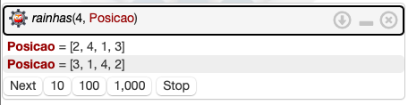

## __Introdução__

* O objetivo deste projeto foi desenvolver um programa para resolver o problema das N-Rainhas na linguagem lógica Prolog. Este relatório apresenta a descrição do problema, explica o algoritmo, documenta o código e exemplifica o uso do programa.

## __Problema N-Rainhas__

* O problema consiste em posicionar um número $N$ de rainhas em um tabuleiro de xadrez $X_{N,N}$. 
* A peça rainha pode ser movimentada em um número ilimitado de casas nas linhas, colunas ou diagonais.
* Uma posição é segura se não está na mesma linha, coluna ou diagonal de outras posições ocupadas por outras rainhas.

## __Construção do Algoritmo__

* O algoritmo foi construindo implementando as condições e restrições necessárias ao problema. Inicialmente uma lista é construida contendo os seguintes valores: $N, N-1, N-2, ..., 1$ e em seguida essa lista é permutada até que uma permutação que atenda as condições e restrições seja encontrada. Em seguida o algoritmo busca outra solução. A solução é apresentada em formato de lista sendo que cada elemento corresponde a posição da rainha nas linhas do tabuleiro, de forma ordenada. A solução consiste em uma permutação da lista originalmente construída porque devemos ter, necessariamente, uma única rainha em cada linha ou coluna.


### __Restrições e Condições Implementadas__

* As restrições e condições do problema em si foram implementadas utilizando fatos e regras na linguagem PROLOG. Cada um desses fatos e regras está descrito a seguir:

#### __lista_rainhas\2__

```{prolog eval=F, error=F, warning=FALSE}
lista_rainhas(0, []).

lista_rainhas(N, [N|Linhas]) :-
	N > 0,
  N1 is N - 1,
  lista_rainhas(N1 , Linhas).
```

Nesta regra temos uma definição recursiva para uma regra com uma união disjunta representando o critério de parada da regra. Na avaliação da regra é verificado se $N$ é maior que zero e, se isso for verdadeiro, o procedimento continua com $N-1$ até atingir $N=0$. O objeto "Linhas" que faz com que a regra seja verdadeira é utilizado pelo algoritmo posteriormente, esse objeto será (para $N$ pertencente ao conjunto dos números naturais) da forma $N, N-1, N-2, ..., 1$.

#### __rainhas\2__

```{prolog, eval = F, warning = F, error = F}
rainhas(N, Posicao) :-
  lista_rainhas(N, Linhas),
  rainhas(Linhas , [], Posicao).
```

Esta é a regra em que a consulta será feita. Para que as $N$ rainhas nas posições *Posicao* sejam válidas (rainhas(N, Posicao)) temos que lista_rainhas(N, Linhas) precisa ser verdadeiro e o algoritmo encontrará o objeto "Linhas" que torna a condição verdadeira, como descrito anteriormente. Na condição "rainhas(Linhas , [], Posicao)" encontrará a Posicao que torna a condição verdadeira para o objeto "Linhas" passado.

#### __select\3__

```{prolog, eval = F, warning = F, error = F}
select([X|Ys], X, Ys).

select([Y|Ys], X, [Y|Zs]) :- select(Ys , X, Zs).
```

Nesta regra temos a definição da condição de escolha de uma posição candidata. Essa regra será usada colocando no primeiro elemento a lista com todas as posições candidatas, no segundo elemento o número que representa a posição candidata e no terceiro elemento a nova lista candidata que é a lista original de candidatas sem o elemento candidato escolhido. Essa regra só é verdadeira quando o terceiro argumento é uma lista igual a lista do primeiro argumento a não ser pelo elemento do segundo argumento da regra.

#### __posicaoSegura\3__

```{prolog, eval = F, warning = F, error = F}
posicaoSegura([], _Rainha , _Nb).

posicaoSegura([Y|Ys], Rainha , Nb) :-
	Rainha =\= Y + Nb ,
  Rainha =\= Y - Nb ,
  Nb1 is Nb + 1,
  posicaoSegura(Ys , Rainha , Nb1).
```

Esta regra verifica as condições e restrições fundamentais do problema que basicamente é a verificação da condição que nenhuma rainha posicionada consegue atacar qualquer outra rainha posicionada. Como a solução é buscada como permutações do objeto "Linhas" incial não é preciso verificar se há rainhas na mesma linha ou coluna que outra rainha, portanto é preciso verificar apenas se não há rainhas nas mesmas diagonais. A verificação é feita de forma recursiva começando com a rainha posicionada na linha anterior a linha da atual candidata e então a segunda linha anterior e assim sucessivamente. A verificação é feita somando e subtraindo $Nb$ da posição das rainhas posicionadas nas linhas anteriores e verificando se o resultado dessas operações é diferente da posição da candidata, utilizando $Nb=1$ para a primeira verificação, $Nb=2$ para a segunda e assim por diante.

#### __rainhas\3__

```{prolog, eval = F, warning = F, error = F}
rainhas([], Posicao , Posicao).

rainhas(NaoPosicionada , Posicionada , Posicao) :-
	select(NaoPosicionada, R, NovaNaoPosicionada),
	posicaoSegura(Posicionada , R, 1),
	rainhas(NovaNaoPosicionada , [R|Posicionada], Posicao).
```

Com esta regra o problema é finalmente solucionado verificando se as condições do "select" e "posicaoSegura" são verdadeiras para cada nova posição candidata e, então, se as condições forem verdadeiras, a candidata é adicionada ao objeto "Posicionda" e a avaliação continua para as linhas ainda não preenchidas. 


## __Exemplo__

* Um exemplo da execução do programa é a resolução do problema com o parâmetro <__4__> para indicar a resolução do problema com 4 rainhas em um tabuleiro 4 x 4.

* Para executar o programa o usuário deve digitar a consulta abaixo com o primeiro argumento sendo o $N$ do problema e o segundo qualquer nome de sua preferência para ser o nome da lista de soluções na impressão e acionar o botão $\fbox{Run}$ no canto inferior direito ou por meio atalho __CTRL + Enter__.

* Finalmente o programa gera uma saída com a primeira solução encontrada para a opção de 4 rainhas em um tabuleiro 4 x 4, para as outras soluções do problema o usuário deve precionar o botão $\fbox{Next}$.


```{prolog, eval = F, warning = F, error = F}
?- rainhas(4, Posicao)
```

&nbsp;&nbsp;&nbsp;&nbsp;&nbsp;


* O compilador Prolog do servidor __swish__  permite executar o programa no sítio:
  * [\textcolor{blue}{https://swish.swi-prolog.org}](https://swish.swi-prolog.org/p/N-Rainhas.pl)


## Referências

* [\textcolor{blue}{https://swi-prolog-reference}](https://swi-prolog.discourse.group/t/useful-prolog-references/1089)

* [\textcolor{blue}{https://www.tutorialspoint.com/prolog/}](https://www.tutorialspoint.com/prolog/)

* [\textcolor{blue}{You Tube}](https://www.youtube.com/watch?v=SykxWpFwMGs)
